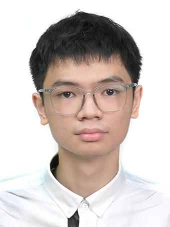
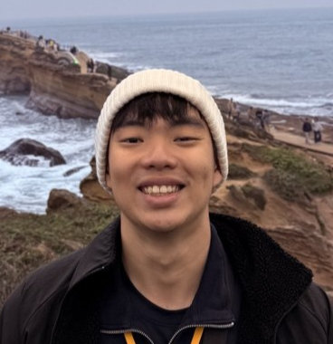
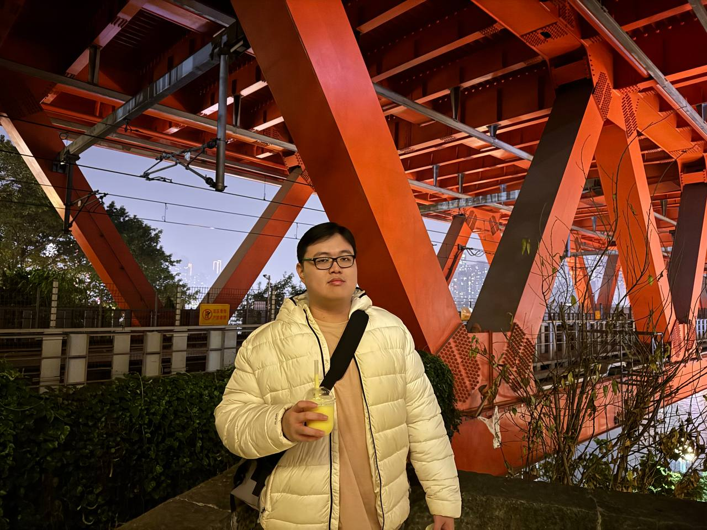

We are a team based in the [School of Computing, National University of Singapore](https://www.comp.nus.edu.sg).

You can reach us at the email `seer[at]comp.nus.edu.sg`

## Project team

### Tom Qiao

[[github](https://github.com/TomQiao0116)]
[[portfolio](team/tomqiao0116.md)]

* Role: Developer
* Responsibilities: Documentation, Git workflow

### FreakkMe

[[github](http://github.com/FreakkMe)]

* Role: Developer
* Responsibilities: UI

### Ee Chern

[[github](http://github.com/chern30)]

* Role: Developer
* Responsibilities: Data

### Jason Kuan

[[github](http://github.com/JasonKuann)]

* Role: Developer
* Responsibilities: Dev Ops + Threading

### Shiroy Sattur

[[github](http://github.com/SSHiroy)]
[[portfolio](team/sshiroy.md)]

* Role: Developer
* Responsibilities: UI
