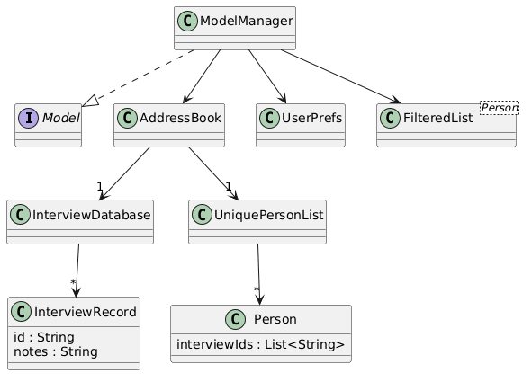
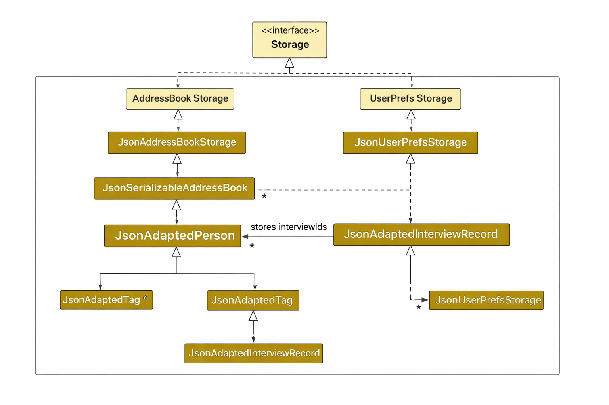
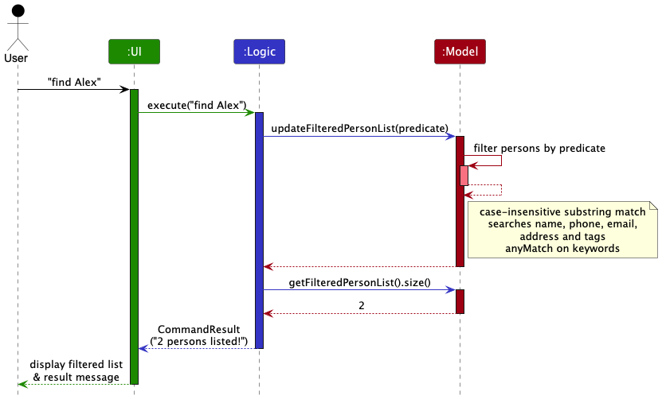
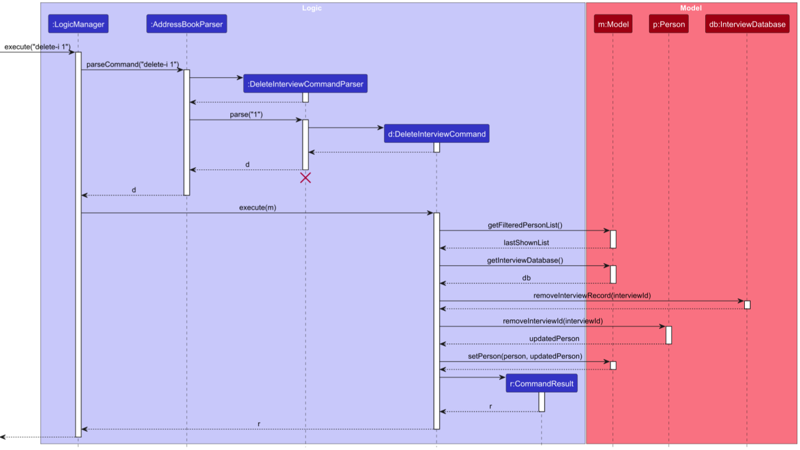
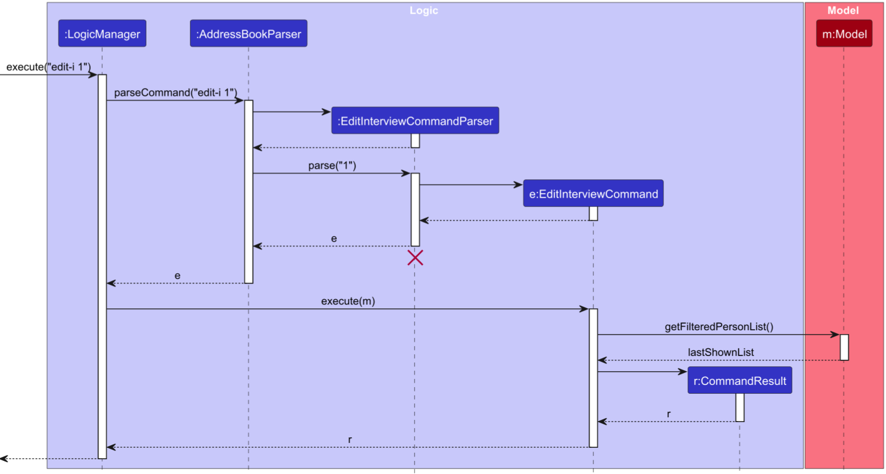

* Table of Contents
{:toc}

--------------------------------------------------------------------------------------------------------------------

## **Acknowledgements**

* {list here sources of all reused/adapted ideas, code, documentation, and third-party libraries -- include links to the original source as well}

--------------------------------------------------------------------------------------------------------------------

## **Setting up, getting started**

Refer to the guide [_Setting up and getting started_](SettingUp.md).

--------------------------------------------------------------------------------------------------------------------

## **Design**

:bulb: **Tip:** The `.puml` files used to create diagrams are in this document `docs/diagrams` folder. Refer to the [_PlantUML Tutorial_ at se-edu/guides](https://se-education.org/guides/tutorials/plantUml.html) to learn how to create and edit diagrams.

### Architecture

The ***Architecture Diagram*** given above explains the high-level design of the App.

Given below is a quick overview of main components and how they interact with each other.

**Main components of the architecture**

**`Main`** (consisting of classes [`Main`](https://github.com/se-edu/addressbook-level3/tree/master/src/main/java/seedu/address/Main.java) and [`MainApp`](https://github.com/se-edu/addressbook-level3/tree/master/src/main/java/seedu/address/MainApp.java)) is in charge of the app launch and shut down.
* At app launch, it initializes the other components in the correct sequence, and connects them up with each other.
* At shut down, it shuts down the other components and invokes cleanup methods where necessary.

The bulk of the app's work is done by the following four components:

* [**`UI`**](#ui-component): The UI of the App.
* [**`Logic`**](#logic-component): The command executor.
* [**`Model`**](#model-component): Holds the data of the App in memory.
* [**`Storage`**](#storage-component): Reads data from, and writes data to, the hard disk.

[**`Commons`**](#common-classes) represents a collection of classes used by multiple other components.

**How the architecture components interact with each other**

The *Sequence Diagram* below shows how the components interact with each other for the scenario where the user issues the command `delete 1`.

Each of the four main components (also shown in the diagram above),

* defines its *API* in an `interface` with the same name as the Component.
* implements its functionality using a concrete `{Component Name}Manager` class (which follows the corresponding API `interface` mentioned in the previous point.

For example, the `Logic` component defines its API in the `Logic.java` interface and implements its functionality using the `LogicManager.java` class which follows the `Logic` interface. Other components interact with a given component through its interface rather than the concrete class (reason: to prevent outside component's being coupled to the implementation of a component), as illustrated in the (partial) class diagram below.

The sections below give more details of each component.

### UI component

The **API** of this component is specified in [`Ui.java`](https://github.com/se-edu/addressbook-level3/tree/master/src/main/java/seedu/address/ui/Ui.java)

The UI consists of a `MainWindow` that is made up of parts e.g.`CommandBox`, `ResultDisplay`, `PersonListPanel`, `StatusBarFooter` etc. All these, including the `MainWindow`, inherit from the abstract `UiPart` class which captures the commonalities between classes that represent parts of the visible GUI.

The `UI` component uses the JavaFx UI framework. The layout of these UI parts are defined in matching `.fxml` files that are in the `src/main/resources/view` folder. For example, the layout of the [`MainWindow`](https://github.com/se-edu/addressbook-level3/tree/master/src/main/java/seedu/address/ui/MainWindow.java) is specified in [`MainWindow.fxml`](https://github.com/se-edu/addressbook-level3/tree/master/src/main/resources/view/MainWindow.fxml)

The `UI` component,

* executes user commands using the `Logic` component.
* listens for changes to `Model` data so that the UI can be updated with the modified data.
* keeps a reference to the `Logic` component, because the `UI` relies on the `Logic` to execute commands.
* depends on some classes in the `Model` component, as it displays `Person` object residing in the `Model`.

### Logic component

**API** : [`Logic.java`](https://github.com/se-edu/addressbook-level3/tree/master/src/main/java/seedu/address/logic/Logic.java)

Here's a (partial) class diagram of the `Logic` component:

The sequence diagram below illustrates the interactions within the `Logic` component, taking `execute("delete 1")` API call as an example.

:information_source: **Note:** The lifeline for `DeleteCommandParser` should end at the destroy marker (X) but due to a limitation of PlantUML, the lifeline continues till the end of diagram.

How the `Logic` component works:

1. When `Logic` is called upon to execute a command, it is passed to an `AddressBookParser` object which in turn creates a parser that matches the command (e.g., `DeleteCommandParser`) and uses it to parse the command.
1. This results in a `Command` object (more precisely, an object of one of its subclasses e.g., `DeleteCommand`) which is executed by the `LogicManager`.
1. The command can communicate with the `Model` when it is executed (e.g. to delete a person). 
   Note that although this is shown as a single step in the diagram above (for simplicity), in the code it can take several interactions (between the command object and the `Model`) to achieve.
1. The result of the command execution is encapsulated as a `CommandResult` object which is returned back from `Logic`.

Here are the other classes in `Logic` (omitted from the class diagram above) that are used for parsing a user command:

How the parsing works:
* When called upon to parse a user command, the `AddressBookParser` class creates an `XYZCommandParser` (`XYZ` is a placeholder for the specific command name e.g., `AddCommandParser`) which uses the other classes shown above to parse the user command and create a `XYZCommand` object (e.g., `AddCommand`) which the `AddressBookParser` returns back as a `Command` object.
* All `XYZCommandParser` classes (e.g., `AddCommandParser`, `DeleteCommandParser`, ...) inherit from the `Parser` interface so that they can be treated similarly where possible e.g, during testing.

### Model component

API : [`Model.java`](https://github.com/AY2526S2-CS2103T-T14-3/tp/blob/master/src/main/java/seedu/address/model/Model.java)

The `Model` component stores and manages the application's in-memory data.

The `Model` component,
* stores all applicant data as `Person` objects.
* stores all interview records separately in an `InterviewDatabase`.
* maintains the association between an applicant and the applicant's interview records using interview record IDs stored in each `Person`.
* stores a filtered list of `Person` objects as an unmodifiable `ObservableList<Person>` for the UI to observe.
* stores a `UserPrefs` object that represents the user's preferences.
* exposes controlled access to internal data through the `Model` API.
* does not depend on the `Ui`, `Logic`, or `Storage` components.

`ModelManager` implements the `Model` interface and acts as the central coordinator of the model. It manages the main data structures used by the application, including the `AddressBook`, `UserPrefs`, and the filtered person list.

The `AddressBook` serves as the main in-memory data container. Besides storing the list of applicants, it also stores an `InterviewDatabase`, which keeps all `InterviewRecord` objects in the system.

The `InterviewDatabase` manages interview records centrally. Each interview record is uniquely identified by an ID and can be retrieved efficiently using that ID. This allows interview records to be created, updated, and removed independently of the applicant list.

Instead of storing full `InterviewRecord` objects inside each `Person`, each `Person` stores only a list of interview record IDs. This design reduces duplication, keeps applicant data lightweight, and makes interview record management more scalable and maintainable.

<box type="info" seamless>

**Design consideration:**  
An alternative design was to store full `InterviewRecord` objects directly inside each `Person`.

We chose to store interview records separately in an `InterviewDatabase` and let each `Person` keep only the corresponding interview record IDs instead. This avoids duplication of interview data and allows interview records to be updated, removed, and managed independently of applicant data.

</box>

## Storage component

API : [`Storage.java`](https://github.com/AY2526S2-CS2103T-T14-3/tp/blob/master/src/main/java/seedu/address/storage/Storage.java)

The `Storage` component is responsible for saving application data to local storage and loading it back when the application starts.

The `Storage` component,
* can save both applicant data and user preferences in JSON format, and read them back into corresponding objects.
* stores all `Person` objects together with all `InterviewRecord` objects in the same JSON save file.
* maintains the association between applicants and interview records using interview record IDs stored in each `Person`.
* exposes controlled access to storage operations through the `Storage` API.
* does not depend on the Ui or Logic components, but depends on some classes in the Model component (since it saves and loads model data).

`StorageManager` implements the `Storage` interface and acts as the central coordinator of the storage component. It manages two main storage handlers: `AddressBookStorage` for application data and `UserPrefsStorage` for user preferences. It delegates read and write operations to these respective storage classes.

The `AddressBookStorage` interface defines methods to read and save `ReadOnlyAddressBook` data, while `UserPrefsStorage` defines methods to handle `UserPrefs`. The `Storage` interface extends both, allowing it to serve as a unified API for all storage operations.

`JsonAddressBookStorage` is responsible for reading and writing the main application data as a JSON file on the hard disk. When saving, it converts the in-memory `ReadOnlyAddressBook` into a `JsonSerializableAddressBook`. When loading, it reads from the JSON file and converts it back into the model’s `AddressBook`. If any illegal values are found in the file, a `DataLoadingException` is thrown.

`JsonSerializableAddressBook` serves as the JSON-friendly representation of the application’s main data. Besides storing applicants, it also stores interview records in a list of `JsonAdaptedInterviewRecord`. During loading, all `Person` objects are reconstructed first, followed by interview records being restored into the `InterviewDatabase` inside the `AddressBook`. This ensures that interview records are centrally managed while still being linked to applicants.

`JsonAdaptedPerson` is the Jackson-friendly version of `Person`. It stores fields such as name, phone, email, address, tags, and a list of `interviewIds`. Instead of storing full interview records inside each `Person`, only the IDs are stored, which correspond to interview records kept in the `InterviewDatabase`. This design avoids data duplication and improves scalability.

`JsonAdaptedInterviewRecord` is the Jackson-friendly version of `InterviewRecord`. It stores the interview record’s ID and notes, and reconstructs the corresponding model object when reading from storage. This supports the design where interview records are stored independently of applicants.

`JsonUserPrefsStorage` handles the storage of `UserPrefs` in JSON format. It is responsible for saving and loading user preferences such as GUI settings and file paths.

Overall, the `Storage` component separates persistence logic from the rest of the application. It uses JSON-specific adapter classes to convert between model objects and storage format, while supporting the project’s extended design of storing interview records centrally and linking them to applicants via IDs.

### Common classes

Classes used by multiple components are in the `seedu.address.commons` package.

--------------------------------------------------------------------------------------------------------------------

## **Implementation**

This section describes some noteworthy details on how certain features are implemented.

### Find command
The `find` command allows users to search for applicants by keyword. The sequence diagram below
shows how the components interact with each other when the user issues the command `find Alex`.

The `find` command does not involve `Storage` as it is a read-only operation — it only updates
the filtered view of the applicant list in `Model`. The predicate tests each person by checking
whether any keyword is a case-insensitive substring match against their name, phone, email,
address, or tags. The UI is automatically refreshed via JavaFX's `ObservableList` binding,
without requiring an explicit callback from `Logic`.

### Interview commands feature

The interview commands feature allows users to manage interview records stored centrally in the `InterviewDatabase` and linked to `Person` objects via an interview ID.

#### Editing Interview Notes (`edit-i`)

The `edit-i` command allows users to edit or add interview notes. Instead of directly modifying the `Model` immediately, the command signals the UI to open an interactive editor. 

Below is the sequence diagram detailing the execution of the `edit-i` command:

#### Deleting Interview Records (`delete-i`)

The `delete-i` command removes a person's interview record. Because records are kept in the global `InterviewDatabase`, the command must perform a dual removal process:
1. Removing the interview record from the `InterviewDatabase`.
2. Unlinking the interview ID from the respective `Person`.

The execution sequence is illustrated below:

#### Listing Interview Records (`list-i`)

The `list-i` command queries the global `InterviewDatabase` directly to fetch and list all existing interview records regardless of which person they belong to. 

The sequence diagram for the operation is as follows:

### \[Proposed\] Undo/redo feature

#### Proposed Implementation

The proposed undo/redo mechanism is facilitated by `VersionedAddressBook`. It extends `AddressBook` with an undo/redo history, stored internally as an `addressBookStateList` and `currentStatePointer`. Additionally, it implements the following operations:

* `VersionedAddressBook#commit()` — Saves the current address book state in its history.
* `VersionedAddressBook#undo()` — Restores the previous address book state from its history.
* `VersionedAddressBook#redo()` — Restores a previously undone address book state from its history.

These operations are exposed in the `Model` interface as `Model#commitAddressBook()`, `Model#undoAddressBook()` and `Model#redoAddressBook()` respectively.

Given below is an example usage scenario and how the undo/redo mechanism behaves at each step.

Step 1. The user launches the application for the first time. The `VersionedAddressBook` will be initialized with the initial address book state, and the `currentStatePointer` pointing to that single address book state.

Step 2. The user executes `delete 5` command to delete the 5th person in the address book. The `delete` command calls `Model#commitAddressBook()`, causing the modified state of the address book after the `delete 5` command executes to be saved in the `addressBookStateList`, and the `currentStatePointer` is shifted to the newly inserted address book state.

Step 3. The user executes `add n/David …​` to add a new person. The `add` command also calls `Model#commitAddressBook()`, causing another modified address book state to be saved into the `addressBookStateList`.

:information_source: **Note:** If a command fails its execution, it will not call `Model#commitAddressBook()`, so the address book state will not be saved into the `addressBookStateList`.

Step 4. The user now decides that adding the person was a mistake, and decides to undo that action by executing the `undo` command. The `undo` command will call `Model#undoAddressBook()`, which will shift the `currentStatePointer` once to the left, pointing it to the previous address book state, and restores the address book to that state.

:information_source: **Note:** If the `currentStatePointer` is at index 0, pointing to the initial AddressBook state, then there are no previous AddressBook states to restore. The `undo` command uses `Model#canUndoAddressBook()` to check if this is the case. If so, it will return an error to the user rather
than attempting to perform the undo.

The following sequence diagram shows how an undo operation goes through the `Logic` component:

:information_source: **Note:** The lifeline for `UndoCommand` should end at the destroy marker (X) but due to a limitation of PlantUML, the lifeline reaches the end of diagram.

Similarly, how an undo operation goes through the `Model` component is shown below:

The `redo` command does the opposite — it calls `Model#redoAddressBook()`, which shifts the `currentStatePointer` once to the right, pointing to the previously undone state, and restores the address book to that state.

:information_source: **Note:** If the `currentStatePointer` is at index `addressBookStateList.size() - 1`, pointing to the latest address book state, then there are no undone AddressBook states to restore. The `redo` command uses `Model#canRedoAddressBook()` to check if this is the case. If so, it will return an error to the user rather than attempting to perform the redo.

Step 5. The user then decides to execute the command `list`. Commands that do not modify the address book, such as `list`, will usually not call `Model#commitAddressBook()`, `Model#undoAddressBook()` or `Model#redoAddressBook()`. Thus, the `addressBookStateList` remains unchanged.

Step 6. The user executes `clear`, which calls `Model#commitAddressBook()`. Since the `currentStatePointer` is not pointing at the end of the `addressBookStateList`, all address book states after the `currentStatePointer` will be purged. Reason: It no longer makes sense to redo the `add n/David …​` command. This is the behavior that most modern desktop applications follow.

Step 7. The user executes `add-i id/I-001 …​` to add a new interview record into the interview list. The `add-i` command then calls `Model#commitAddressBook()`, causing the modified address book state to be saved into the `addressBookStateList`.

The following activity diagram summarizes what happens when a user executes a new command:

#### Design considerations:

**Aspect: How undo & redo executes:**

* **Alternative 1 (current choice):** Saves the entire address book.
  * Pros: Easy to implement.
  * Cons: May have performance issues in terms of memory usage.

* **Alternative 2:** Individual command knows how to undo/redo by
  itself.
  * Pros: Will use less memory (e.g. for `delete`, just save the person being deleted).
  * Cons: We must ensure that the implementation of each individual command are correct.

_{more aspects and alternatives to be added}_

### \[Proposed\] Data archiving

_{Explain here how the data archiving feature will be implemented}_

--------------------------------------------------------------------------------------------------------------------

## **Documentation, logging, testing, configuration, dev-ops**

* [Documentation guide](Documentation.md)
* [Testing guide](Testing.md)
* [Logging guide](Logging.md)
* [Configuration guide](Configuration.md)
* [DevOps guide](DevOps.md)

--------------------------------------------------------------------------------------------------------------------

## **Appendix: Requirements**

### Product scope

**Target user profile**:

* An NUS CCA Leader or Interviewer involved in managing a recruitment drive
* Has a need to record and track a significant number of applicants and interview outcomes
* Prefers desktop CLI apps over mouse-driven interfaces
* Can type fast and is comfortable with CLI applications
* Works with teammates through a **single shared instance of the app**, which acts as the single source of truth for all recruitment data — no individual accounts needed

**Value proposition**: Centralise applicant contact details and interview evaluations in a single offline platform, eliminating the need to juggle Google Sheets, Telegram messages, and Word documents — enabling faster and more accurate recruitment tracking than a typical GUI-driven app.

### User stories

Priorities: High (must have) - `* * *`, Medium (nice to have) - `* *`, Low (unlikely to have) - `*`

| Priority | As a …​       | I want to …​                                               | So that I can…​                                                          |
| -------- | ------------- | ---------------------------------------------------------- | ------------------------------------------------------------------------ |
| `* * *`  | CCA Leader    | add a new applicant with their Student ID and Phone Number | have a unique record for every person who signed up                      |
| `* * *`  | CCA Leader    | view a consolidated list of all applicants and their interview statuses | track the overall progress of the recruitment drive     |
| `* * *`  | CCA Leader    | delete an incorrect applicant entry                        | ensure the data remains accurate if a mistake was made during entry      |
| `* *`    | CCA Leader    | search for an applicant by name or Student ID              | locate a specific applicant's record quickly                             |
| `* * *`  | Interviewer   | add interview scores and comments to an existing applicant | keep all feedback tied to the applicant's profile in one place           |
| `* *`    | Interviewer   | filter the list to show only applicants with "Pending" interviews | know exactly who I need to interview next                           |
| `* *`    | Interviewer   | search for an applicant by name or phone number            | quickly pull up their record during a live interview session             |
| `*`      | Interviewer   | undo a command                                             | quickly revert an accidental edit without re-typing                      |

### Use cases

(For all use cases below, the **System** is the `HRdex` and the **Actor** is the `user`, unless specified otherwise)

**UC1. Add an applicant record**

**System:** HRdex

**Use Case:** UC1 - Add applicant record

**Actor:** CCA Leader

**Precondition:** 
- The application is running and user is at the main screen.

**Guarantees:**

- **Success guarantee:** A new applicant record with valid name, student ID and phone number is stored in the database.

- **Failure guarantee:** No new applicant record is added.

**MSS**

1.  CCA Leader enters the command to add an applicant record with a name, student ID and phone number.
2.  HRdex validates the applicant name format.
3.  HRdex validates the applicant student ID format.
4.  HRdex validates the applicant phone number format.
5.  HRdex checks whether the applicant student ID or phone number already exists in the database.
6.  HRdex creates the new applicant record.
7.  HRdex displays a success message with the applicant details.

    Use case ends.

**Extensions**

* 1a. Required parameters are missing.

   * 1a1. HRdex shows the correct command usage.

     Use case ends.
     
* 1b. A parameter is specified more than once.

  * 1b1. HRdex shows an error message indicating that duplicate parameters are not allowed.
 
    Use case ends.

* 2a. The name format is invalid.

  * 2a1. HRdex shows an error message indicating invalid name format.

    Use case ends.

* 3a. The student ID format is invalid.

  * 3a1. HRdex shows an error message indicating invalid student ID format.

    Use case ends.

* 4a. The phone number format is invalid.

    * 4a1. HRdex shows an error message indicating invalid phone number format.

      Use case ends.

* 5a. The student ID already exists in the database.

    * 5a1. HRdex shows an error message that the applicant already exists.

      Use case ends.

* 5b. The phone number already exists in the database.

    * 5b1. HRdex shows an error message that the applicant already exists.

      Use case ends.

**UC2. Delete an applicant record**

**System:** HRdex

**Use Case:** UC2 - Delete applicant record

**Actor:** CCA Leader

**Precondition:** 
- The application is running and the user is at the main screen.

**Guarantees:**

- **Success guarantee:** The applicant record is removed from the database. Any associated interview record is also removed.

- **Failure guarantee:** No records are deleted.

**MSS**

1.  CCA Leader enters the command to delete an applicant using the applicant's student ID or phone number.
2.  HRdex validates the identifier format.
3.  HRdex searches for the matching applicant record.
4.  HRdex deletes the applicant record.
5.  HRdex deletes the applicant's associated interview record if it exists.
6.  HRdex displays a success message.

    Use case ends.

**Extensions**

* 1a. Required parameters are missing.

   * 1a1. HRdex shows the correct command usage.

     Use case ends.

* 2a. The student ID format is invalid.

  * 2a1. HRdex shows an error message indicating invalid student ID format.

    Use case ends.

* 2b. The phone number format is invalid.

    * 2b1. HRdex shows an error message indicating invalid phone number format.

      Use case ends.

* 3a. No applicant matches the student ID or phone number.

    * 3a1. HRdex shows an error message indicating that the applicant does not exist.

      Use case ends.

**UC3. View a full applicant record**

**System:** HRdex

**Use Case:** UC3 - View a full applicant record

**Actor:** CCA Leader

**Precondition:** 
- The application is running and the user is at the main screen.

**Guarantees:**

- **Success guarantee:** The system displays the applicant's full record, including interview details if available.

- **Failure guarantee:** No record is displayed.

**MSS**

1.  CCA Leader enters the command to view an applicant record using applicant's name or student ID.
2.  HRdex validates the identifier format.
3.  HRdex searches for the matching applicant record.
4.  HRdex finds exactly one matching applicant.
5.  HRdex retrieves the applicant’s personal details.
6.  HRdex retrieves the applicant's associated interview record if it exists.
7.  HRdex displays the full applicant record.

    Use case ends.

**Extensions**

* 1a. Required parameters are missing.

   * 1a1. HRdex shows the correct command usage.

     Use case ends.

* 2a. The student ID format is invalid.

  * 2a1. HRdex shows an error message indicating invalid student ID format.

    Use case ends.

* 3a. No applicant matches the student ID.

   * 3a1. HRdex shows an error message indicating that the applicant does not exist.

      Use case ends.

* 3b. More than one applicant matches the given name.
  
   * 3b1. HRdex informs the user that multiple applicants match the given name.
 
   * 3b2. HRdex asks the user to specify the Student ID or phone number.

     Use case ends.

* 6a. No interview record exists for the applicant.

    * 6a1. HRdex displays the applicant’s personal details
    
    * 6a2. HRdex indicates that no interview record is available.
 
      Use case ends.

**UC4. View a consolidated applicant list**

**System:** HRdex

**Use Case:** UC4 - View consolidated applicant list

**Actor:** CCA Leader

**Precondition:** 
- The application is running and the user is at the main screen.

**Guarantees:**

- **Success guarantee:** HRdex displays a consolidated list of all applicants and their interview statuses.

- **Failure guarantee:** No list is displayed.

**MSS**

1.  CCA Leader enters the command to view the applicant list.
2.  HRdex retrieves all applicant records and their interview statuses
3.  HRdex displays the consolidated applicant list.

    Use case ends.

**Extensions**

* 1a. The command format is invalid.

   * 1a1. HRdex shows the correct command usage.

     Use case ends.

* 2a. No applicant records exist in the database.

  * 2a1. HRdex displays an empty applicant list message.

    Use case ends.

**UC5. Add an interview record to an existing applicant**

**System:** HRdex

**Use Case:** UC5 - Add interview record to existing applicant

**Actor:** Interviewer

**Precondition:** 
- The application is running and the user is at the main screen.

**Guarantees:**

- **Success guarantee:** A new interview record is assigned to the correct applicant.

- **Failure guarantee:** No interview record is added.

**MSS**

1.  Interviewer enters the command to add an interview record using the applicant’s student ID or phone number, score, result, and comment.
2.  HRdex validates the identifier format.
3.  HRdex searches for the applicant using the provided identifier.
4.  HRdex validates the interview score.
5.  HRdex validates the interview result.
6.  HRdex validates the interview comment length.
7.  HRdex checks whether the applicant already has an interview record.
8.  HRdex adds the interview record to the identified applicant.
9.  HRdex displays a success message with the interview details.

    Use case ends.

**Extensions**

* 1a. Required parameters are missing.

   * 1a1. HRdex shows the correct command usage.

     Use case ends.

* 2a. The student ID format is invalid.

  * 2a1. HRdex shows an error message indicating invalid student ID format.

    Use case ends.

* 2b. The phone number format is invalid.

  * 2b1. HRdex shows an error message indicating invalid phone number format.

    Use case ends.

* 3a. No applicant with the given identifier exists.

    * 3a1. HRdex shows an error message indicating that the applicant does not exist.

      Use case ends.

* 4a. The interview score is outside the accepted range.

    * 4a1. HRdex shows an error message indicating invalid interview score.

      Use case ends.
      
* 5a. The interview result is invalid.
  
    * 5a1. HRdex shows an error message indicating invalid interview result.

      Use case ends.

* 6a. The interview comment exceeds the maximum allowed length.

    * 6a1. HRdex shows an error message indicating that the maximum allowed length has been exceeded.
 
      Use case ends.

* 7a. The applicant already has an interview record.

    * 7a1. HRdex shows an error message indicating that only one interview record is allowed.
 
      Use case ends.

**UC6. Delete an interview record**

**System:** HRdex

**Use Case:** UC6 - Delete interview record

**Actor:** Interviewer

**Precondition:** 
- The application is running and the user is at the main screen.

**Guarantees:**

- **Success guarantee:** The interview record is removed, while the applicant record remains in the database.

- **Failure guarantee:** No interview record is deleted.

**MSS**

1.  Interviewer enters the command to delete an interview record for a specific applicant.
2.  HRdex identifies the applicant using the provided student ID or phone number.
3.  HRdex checks that an interview record exists for that applicant.
4.  HRdex deletes the interview record.
5.  HRdex displays a success message.

    Use case ends.

**Extensions**

* 1a. Required parameters are missing.

   * 1a1. HRdex shows the correct command usage.

     Use case ends.

* 2a. The student ID format is invalid.

  * 2a1. HRdex shows an error message indicating invalid student ID format.

    Use case ends.

* 2b. The phone number format is invalid.

  * 2b1. HRdex shows an error message indicating invalid phone number format.

    Use case ends.

* 2c. No matching applicant is found.

  * 2c1. HRdex shows an error message indicating that no matching applicant was found.

    Use case ends.
    
* 3a. The applicant exists but has no interview record.

    * 3a1. HRdex shows an error message indicating that no interview record exists.

      Use case ends.

**UC7. Search for an applicant**

**System:** HRdex

**Use Case:** UC7 - Search for an applicant

**Actor:** Interviewer

**Precondition:** 
- The application is running and the user is at the main screen.

**Guarantees:**

- **Success guarantee:** HRdex displays the applicant record or list of matching applicant records.

- **Failure guarantee:** No matching record is displayed.

**MSS**

1.  Interviewer enters the command to search for an applicant using name or phone number.
2.  HRdex validates the provided search input.
3.  HRdex searches for matching applicant records.
4.  HRdex displays the matching applicant record or records.

    Use case ends.

**Extensions**

* 1a. Required parameters are missing.

   * 1a1. HRdex shows the correct command usage.

     Use case ends.

* 2a. The phone number format is invalid.

  * 2a1. HRdex shows an error message indicating invalid phone number format.

    Use case ends.
    
* 3a. No applicant matches the search input.

    * 3a1. HRdex shows an error message indicating that no matching applicant was found.

      Use case ends.

**UC8. Filter applicants by interview status**

**System:** HRdex

**Use Case:** UC8 - Filter applicants by interview status

**Actor:** Interviewer

**Precondition:** 
- The application is running and the user is at the main screen.

**Guarantees:**

- **Success guarantee:** HRdex displays only applicants with the specified interview status.

- **Failure guarantee:** No filtered list is displayed.

**MSS**

1.  Interviewer enters the command to filter applicants by interview status.
2.  HRdex validates the provided interview status.
3.  HRdex retrieves applicant records matching the specified status.
4.  HRdex displays the filtered applicant list.

    Use case ends.

**Extensions**

* 1a. Required parameters are missing.

   * 1a1. HRdex shows the correct command usage.

     Use case ends.

* 2a. The provided interview status is invalid.

  * 2a1. HRdex shows an error message indicating invalid interview status.

    Use case ends.
    
* 3a. No applicants match the specified status.

    * 3a1. HRdex displays an empty filtered list message.

      Use case ends.

     
### Non-Functional Requirements

1.  Should work on any devices with Windows, macOS or Linux installed as long as it has Java `17` or above installed.
2.  Should be able to hold up to 1000 applicant records without a noticeable sluggishness in performance for typical usage.
3.  A user with above average typing speed for regular English text (i.e. not code, not system admin commands) should be able to accomplish most of the tasks faster using commands than using the mouse.
4.  A new user with basic command-line familiarity should be able to learn and use the core features of the product within 30 minutes by referring to the User Guide.
5.  Should respond to typical user commands within 2 seconds when operating on a dataset of up to 1000 applicant records.
6.  Should store data locally on the user’s device so that it can be used without an internet connection.
7.  Should preserve data between sessions by saving all applicant and interview records to persistent storage.
8.  Should preserve data between devices by saving persistent storage within the app and not locally.
9.  Should have a predictable location for data within the app
10.  Should reject invalid inputs with clear and specific error messages, so that users can correct their commands easily.
11.  Should prevent ambiguous or inconsistent data states, such as duplicate applicants with the same student ID or phone number, or multiple interview records for one applicant.
12.  Should be able to recover from invalid commands without crashing or corrupting stored data.
13.  Should remain usable on screens with a resolution of 1280×720 or higher.
14.  Should be maintainable enough for future student developers to add new commands or extend the interview record model with reasonable effort.
15.  Command formats should remain consistent across similar operations so that users can learn the system quickly.

### Glossary

| Term | Definition |
| :--- | :--- |
| **Applicant** | A student who has applied for the CCA and exists as a record in the system, identified uniquely by their Phone Number or Student ID. |
| **CCA Leader** | One of the two primary user roles. The CCA Leader oversees the entire recruitment process — they manage the applicant list, review overall interview outcomes, and make final admission decisions. They do not necessarily conduct interviews themselves. |
| **Interviewer** | One of the two primary user roles. The Interviewer conducts face-to-face interview sessions with applicants and records scores and comments directly into the app. They focus on per-applicant data entry rather than overall recruitment management. |
| **CLI** | Command Line Interface; the primary mode of interaction where users type text commands. |
| **Interview Record** | A data entity attached to an Applicant containing a score (1–5), a result (Pass/Fail/Pending), and qualitative comments from the interview session. |
| **Local App** | An application that stores all data on the computer's hard drive without requiring an internet connection. |
| **Mainstream OS** | Windows, Linux, Unix, macOS. |
| **Single Source of Truth** | The single shared app instance used by all CCA members (both Leaders and Interviewers) to ensure all recruitment data is consistent and centralised. |
| **Unique Identifier** | A piece of data (Phone Number or Student ID) used to distinguish between applicants with the same name. |

--------------------------------------------------------------------------------------------------------------------

## **Appendix: Instructions for manual testing**

Given below are instructions to test the app manually.

:information_source: **Note:** These instructions only provide a starting point for testers to work on;
testers are expected to do more *exploratory* testing.

### Launch and shutdown

1. Initial launch

   1. Download the jar file and copy into an empty folder

   1. Double-click the jar file Expected: Shows the GUI with a set of sample contacts. The window size may not be optimum.

1. Saving window preferences

   1. Resize the window to an optimum size. Move the window to a different location. Close the window.

   1. Re-launch the app by double-clicking the jar file. 
       Expected: The most recent window size and location is retained.

1. _{ more test cases …​ }_

### Deleting a person

1. Deleting a person while all persons are being shown

   1. Prerequisites: List all persons using the `list` command. Multiple persons in the list.

   1. Test case: `delete 1` 
      Expected: First contact is deleted from the list. Details of the deleted contact shown in the status message. Timestamp in the status bar is updated.

   1. Test case: `delete 0` 
      Expected: No person is deleted. Error details shown in the status message. Status bar remains the same.

   1. Other incorrect delete commands to try: `delete`, `delete x`, `...` (where x is larger than the list size) 
      Expected: Similar to previous.

1. _{ more test cases …​ }_

### Saving data

1. Dealing with missing/corrupted data files

   1. _{explain how to simulate a missing/corrupted file, and the expected behavior}_

1. _{ more test cases …​ }_
