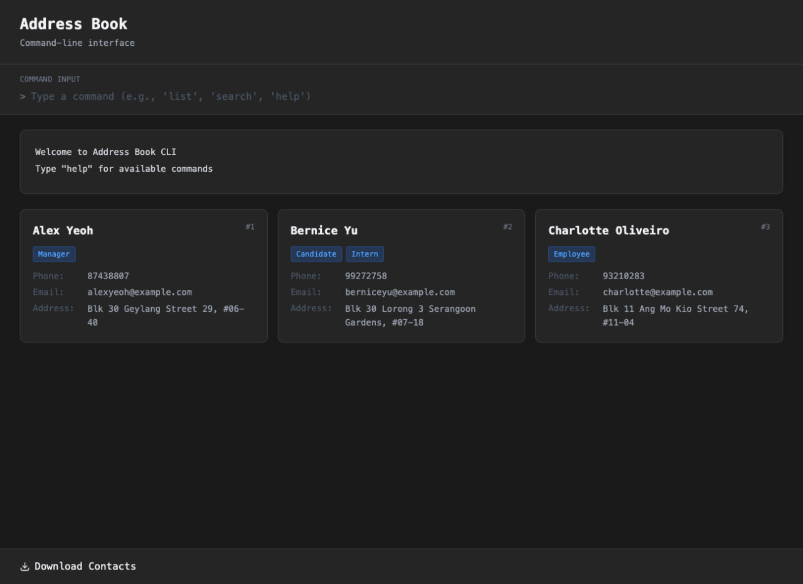
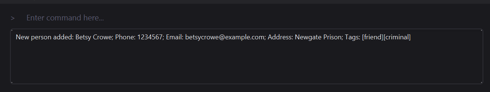
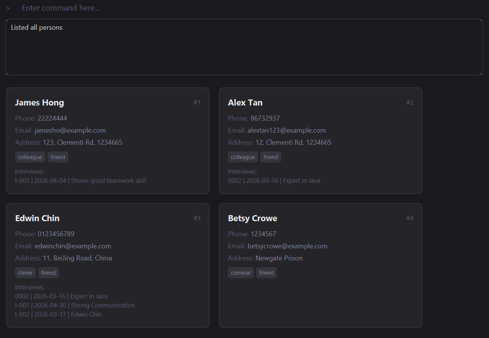
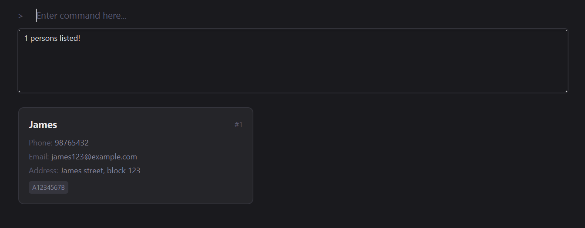
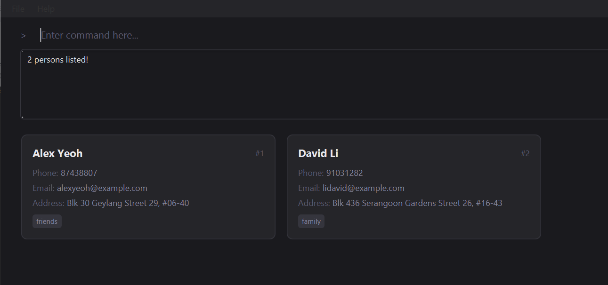
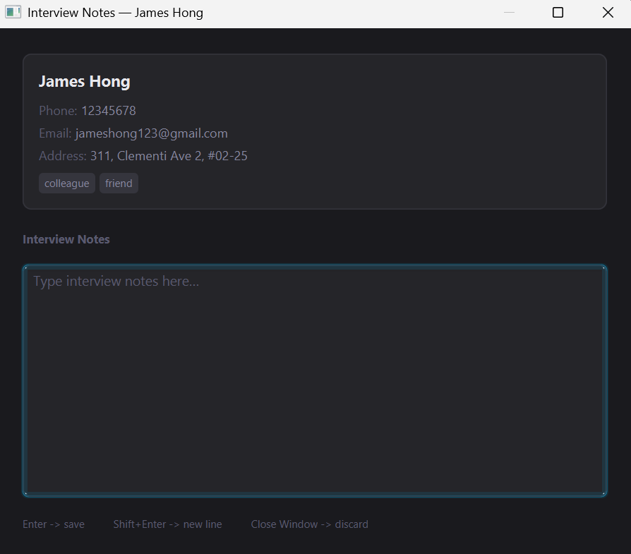
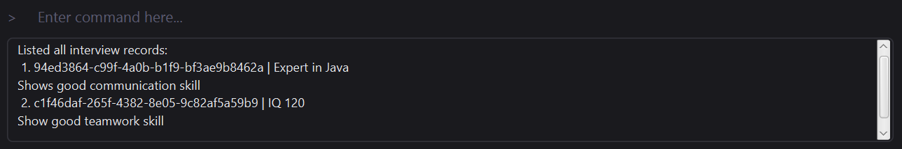

AddressBook Level 3 (AB3) is a **desktop app for managing contacts, optimized for use via a Command Line Interface** (CLI) while still having the benefits of a Graphical User Interface (GUI). If you can type fast, AB3 can get your contact management tasks done faster than traditional GUI apps.

* Table of Contents
{:toc}

--------------------------------------------------------------------------------------------------------------------

## Quick start

1. Ensure you have Java `17` or above installed in your Computer. 
   **Mac users:** Ensure you have the precise JDK version prescribed [here](https://se-education.org/guides/tutorials/javaInstallationMac.html).

1. Download the latest `.jar` file from [here](https://github.com/se-edu/addressbook-level3/releases).

1. Copy the file to the folder you want to use as the _home folder_ for your AddressBook.

1. Open a command terminal, `cd` into the folder you put the jar file in, and use the `java -jar addressbook.jar` command to run the application. 
   A GUI similar to the below should appear in a few seconds. Note how the app contains some sample data. 
   

1. Type the command in the command box and press Enter to execute it. e.g. typing **`help`** and pressing Enter will open the help window. 
   Some example commands you can try:

   * `list` : Lists all applicants.

   * `add n/John Doe p/98765432 e/johnd@example.com a/John street, block 123, #01-01` : Adds an applicant named `John Doe` to HRdex.

   * `delete 3` : Deletes the 3rd applicant shown in the current list.

   * `clear` : Deletes all applicant records.

   * `exit` : Exits the app.

1. Refer to the [Features](#features) below for details of each command.

--------------------------------------------------------------------------------------------------------------------

## Features

**:information_source: Notes about the command format:** 

* Words in `UPPER_CASE` are the parameters to be supplied by the user. 
  e.g. in `add n/NAME`, `NAME` is a parameter which can be used as `add n/John Doe`.

* Items in square brackets are optional. 
  e.g `n/NAME [t/TAG]` can be used as `n/John Doe t/friend` or as `n/John Doe`.

* Items with `…`​ after them can be used multiple times including zero times. 
  e.g. `[t/TAG]…​` can be used as ` ` (i.e. 0 times), `t/friend`, `t/friend t/family` etc.

* Parameters can be in any order. 
  e.g. if the command specifies `n/NAME p/PHONE_NUMBER`, `p/PHONE_NUMBER n/NAME` is also acceptable.

* Extraneous parameters for commands that do not take in parameters (such as `help`, `list`, `exit` and `clear`) will be ignored. 
  e.g. if the command specifies `help 123`, it will be interpreted as `help`.

* If you are using a PDF version of this document, be careful when copying and pasting commands that span multiple lines as space characters surrounding line-breaks may be omitted when copied over to the application.

### Viewing help : `help`

Shows a message explaining how to access the help page.

Format: `help`

### Adding an applicant record: `add`

Adds an applicant record to HRdex.

Format: `add n/NAME p/PHONE_NUMBER e/EMAIL a/ADDRESS [t/TAG]…​`

* A person can have any number of tags (including 0).
* The `PHONE_NUMBER` is the unique id for a specific person, i.e. 2 or more people who shares a `PHONE_NUMBER` leads to an command error.

Examples:
* `add n/John Doe p/98765432 e/johnd@example.com a/John street, block 123, #01-01`
* `add n/Betsy Crowe t/friend e/betsycrowe@example.com a/Newgate Prison p/1234567 t/criminal`

Expected output:
* Command success:
    * New person added: `NAME`; Phone: `PHONE_NUMBER`; Email: `EMAIL`; Address: `ADDRESS`; Tags: `TAG`…​
      

* Command fail:

Error Message | Reason
--------|------------------
**This person already exists in the address book** | This indicates a person with the specified `PHONE_NUMBER` already exist.
**Multiple values specified for the following single-valued field(s): [x/]...** | This indicates there is multiple value of [x/]... in the use of the command. The command only takes in one of each [x/]... except for tags (t/).
**Invalid command format!**   **add: Adds a person to the address book. Parameters: n/NAME p/PHONE e/EMAIL a/ADDRESS [t/TAG]...**   **Example: add n/John Doe p/98765432 e/johnd@example.com a/311, Clementi Ave 2, #02-25 t/friends t/owesMoney** | This indicates there is an error in the format of the command.

### Listing all persons : `list`

Shows a list of all persons in the address book.

Format: `list`

* Even if there is any value input after `list`, the command still works.

Expected output:
* Command success:
    * Listed all persons:

      `THE LIST OF ALL PEOPLE`
      

* Command fail:

Error Message | Reason
--------|------------------
- | -

### Editing a person : `edit`

Edits an existing person in the address book.

Format: `edit INDEX [n/NAME] [p/PHONE] [e/EMAIL] [a/ADDRESS] [t/TAG]…​`

* Edits the person at the specified `INDEX`. The index refers to the index number shown in the displayed person list. The index **must be a positive integer** 1, 2, 3, …​
* At least one of the optional fields must be provided.
* Existing values will be updated to the input values.
* When editing tags, the existing tags of the person will be removed i.e adding of tags is not cumulative.
* You can remove all the person’s tags by typing `t/` without
    specifying any tags after it.

Examples:
*  `edit 1 p/91234567 e/johndoe@example.com` Edits the phone number and email address of the 1st person to be `91234567` and `johndoe@example.com` respectively.
*  `edit 2 n/Betsy Crower t/` Edits the name of the 2nd person to be `Betsy Crower` and clears all existing tags.

Expected output:
* Command success:
    * Edited Person: `NAME`; Phone: `PHONE_NUMBER`; Email: `EMAIL`; Address: `ADDRESS`; Tags: `TAG`…​
      

* Command fail:

Error Message | Reason
--------|------------------
**The person index provided is invalid** | This indicates the `INDEX` provided is invalid.
**At least one field to edit must be provided.** | This indicates there is no edit details provided.
**Invalid command format!**   **edit: Edits the details of the person identified by the index number used in the displayed person list. Existing values will be overwritten by the input values.**   **Parameters: INDEX (must be a positive integer) [n/NAME] [p/PHONE] [e/EMAIL] [a/ADDRESS] [t/TAG]...**   **Example: edit 1 p/91234567 e/johndoe@example.com** | This indicates there is an error in the format of the command.

### Locating persons: `find`

Finds persons whose details contain any of the given keywords.

Format: `find KEYWORD [MORE_KEYWORDS]`

* The search is case-insensitive. e.g `hans` will match `Hans`
* The order of the keywords does not matter. e.g. `Hans Bo` will match `Bo Hans`
* Names, phones, emails, addresses and tags are searched.
* Partial words will be matched e.g. `Han` will match `Hans`
* Applicants matching at least one keyword will be returned (i.e. `OR` search).
  e.g. `Hans Bo` will return applicants with the name `Hans Gruber`, `Bo Yang`

Examples:
* `find John` returns `john` and `John Doe`
* `find 9123` returns applicants whose phone number contains `9123`
* `find A1234567B` returns `James` tagged with `A1234567B` 
  
* `find alex david` returns `Alex Yeoh`, `David Li` 
  

Expected output:
* Command success:
    * `n` persons listed!
      `THE LIST OF ALL PEOPLE WITH KEYWORD [MORE_KEYWORDS]`

* Command fail:

Error Message | Reason
--------|------------------
**Invalid command format!**   **find: Finds all persons whose details contain any of the specified keywords (case-insensitive) and displays them as a list with index numbers.**   **Parameters: KEYWORD [MORE_KEYWORDS]...**   **Example: find alice bob charlie** | This indicates there is no `KEYWORD` provided after the `find` command.

### Editing an interview record : `edit-i`

Edits an interview record of a person on the address book.

Format: `edit-i INDEX`

* Edits the interview record of the person of the specified `INDEX`.
* Opens a popup window for the applicant at the specified `INDEX`.
* The popup window allows the user to enter or modify the interview record content for that applicant.
* The index refers to the index number shown in the displayed person list.
* The index **must be a positive integer** 1, 2, 3, …​
* Each person when created is directly linked to an empty interview record so just edit the record instead of adding it.
* Each changes made for a person is saved automatically and closing the panel saves all the changes.
* If the applicant already has an interview record, the existing content will be shown in the popup window and can be edited.

Examples:
* `list` followed by `edit-i 2` edits the interview record of the 2nd person in the address book.
* `find Betsy` followed by `edit-i 1` edits the interview record of the 1st person in the results of the `find` command.

Expected output:
* Command success:
    * Opening interview editor for: `NAME` 
       

    * The panel of editing interview record:
  
       

* Command fail:

Error Message | Reason
--------|------------------
**The person index provided is invalid** | This indicates the `INDEX` provided is invalid.
**At least one field to edit must be provided.** | This indicates there is no edit details provided.
**Invalid command format!**   **edit-i: Opens the interview notes editor for the person at the given index.**   **Parameters: INDEX (must be a positive integer)**   **Example: edit-i 1** | This indicates there is an eror in the format of the command.

### Deleting an interview record : `delete-i`

Clears an interview record of a person on the address book.

Format: `delete-i INDEX`

* Clears the interview record of the person of the specified `INDEX`.
* The index refers to the index number shown in the displayed person list.
* The index **must be a positive integer** 1, 2, 3, …​
* Simply clears all interview record of the specific person or sort of 'reinitialize' the interview record.

Examples:
* `list` followed by `delete-i 2` clears the interview record of the 2nd person in the address book.
* `find Betsy` followed by `delete-i 1` clears the interview record of the 1st person in the results of the `find` command.

Expected output:
* Command success:
    * Deleted interview record for: James Hong
      

* Command fail:

Error Message | Reason
--------|------------------
**The person index provided is invalid** | This indicates the `INDEX` provided is invalid.
**This person has no interview record.** | This indicates the person with the `INDEX` provided has empty interview record.
**Invalid command format!**   **delete-i: Deletes the interview record of the person at the given index.**   **Parameters: INDEX (must be a positive integer)**   **Example: delete-i 1** | This indicates there is an eror in the format of the command.

### List all interview records : `list-i`

Shows a list of all interview records in the address book.

* The interview record list displays the interview record in the order that it was added.

Format: `list-i`

Expected output:
* Command success:
    * Listed all interview records:

      `THE INTERVIEW RECORD LIST`
      

* Command fail:

Error Message | Reason
--------|------------------
- | -

### Finding interview records by keyword : `find-i`

Finds applicants whose interview records contain specific keywords.

Format: `find-i KEYWORD [MORE_KEYWORDS]`

* The search is case-insensitive. e.g. `java` will match `Java`
* The search checks the content of interview records entered in the popup window.
* Applicants whose interview records contain any of the given keywords will be displayed.
* Only full keywords are matched based on substring search.

Examples:
* `find-i java`
* `find-i communication teamwork`

Expected output:

* Command success:
    * `n` persons listed!
      `THE LIST OF MATCHING APPLICANTS`

* Command fail:

Error Message | Reason
--- | ---
Invalid command format! | No keyword is provided after the command.

### Clearing all entries : `clear`

Clears all entries in the address book.

Format: `clear`

Expected output:
* Command success:
    * Address book has been cleared!
      

* Command fail:

Error Message | Reason
--------|------------------
- | -

### Exiting the program : `exit`

Exits the program.

Format: `exit`

### Saving the data

AddressBook data are saved in the hard disk automatically after any command that changes the data. There is no need to save manually.

### Editing the data file

AddressBook data are saved automatically as a JSON file `[JAR file location]/data/addressbook.json`. Advanced users are welcome to update data directly by editing that data file.

:exclamation: **Caution:**
If your changes to the data file makes its format invalid, AddressBook will discard all data and start with an empty data file at the next run. Hence, it is recommended to take a backup of the file before editing it. 
Furthermore, certain edits can cause the AddressBook to behave in unexpected ways (e.g., if a value entered is outside of the acceptable range). Therefore, edit the data file only if you are confident that you can update it correctly.

### Archiving data files `[coming in v2.0]`

_Details coming soon ..._

--------------------------------------------------------------------------------------------------------------------

## FAQ

**Q**: How do I transfer my data to another Computer? 
**A**: Install the app in the other computer and overwrite the empty data file it creates with the file that contains the data of your previous AddressBook home folder.

--------------------------------------------------------------------------------------------------------------------

## Known issues

1. **When using multiple screens**, if you move the application to a secondary screen, and later switch to using only the primary screen, the GUI will open off-screen. The remedy is to delete the `preferences.json` file created by the application before running the application again.
2. **If you minimize the Help Window** and then run the `help` command (or use the `Help` menu, or the keyboard shortcut `F1`) again, the original Help Window will remain minimized, and no new Help Window will appear. The remedy is to manually restore the minimized Help Window.

--------------------------------------------------------------------------------------------------------------------

## Command summary

Action | Format, Examples
--------|------------------
**Add** | `add n/NAME p/PHONE_NUMBER e/EMAIL a/ADDRESS [t/TAG]…​`   e.g., `add n/James Ho p/22224444 e/jamesho@example.com a/123, Clementi Rd, 1234665 t/friend t/colleague`
**Clear** | `clear`
**Delete** | `delete INDEX`  e.g., `delete 3`
**Edit** | `edit INDEX [n/NAME] [p/PHONE_NUMBER] [e/EMAIL] [a/ADDRESS] [t/TAG]…​`  e.g.,`edit 2 n/James Lee e/jameslee@example.com`
**Find** | `find KEYWORD [MORE_KEYWORDS]`  e.g., `find James Jake`or `find A1234567B`
**List** | `list`
**Interview List** | `list-i`
**Edit Interview Record** | `edit-i INDEX`  e.g., `edit-i 1`
**Delete Interview Record** | `delete-i INDEX`  e.g., `delete-i 1`
**Find Interview Record** | `find-i KEYWORD [MORE_KEYWORDS]`  e.g., `find-i java`
**Help** | `help`
